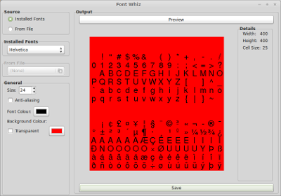

Font Whiz
=========

Font Whiz is an open source fixed width bitmap font generator for Linux, Windows and Mac. It can use installed fonts or fonts from a file. This tool was created to output fonts to an image for fast rendering in games development.

